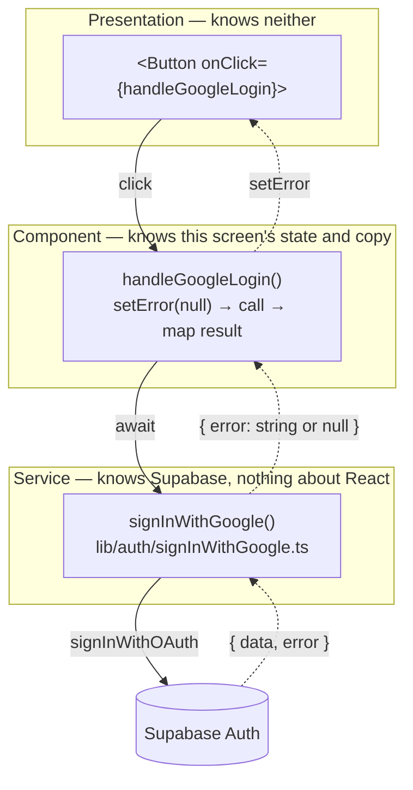
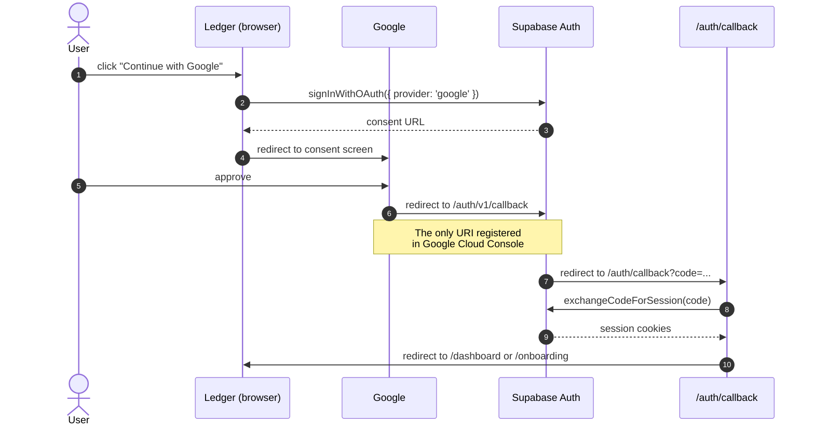
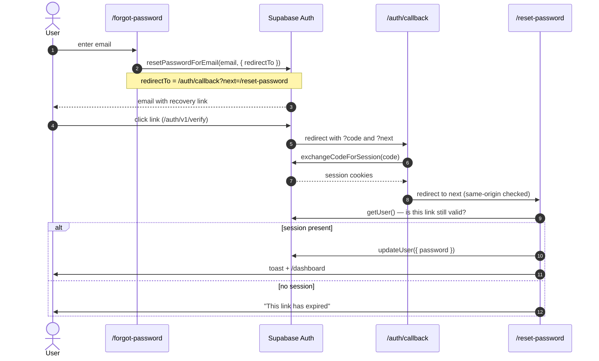

# Auth Patterns

> **Added:** 2026-09-08
> **Applies to:** `apps/web/src/lib/auth/`, `apps/web/src/app/(auth)/`, `apps/web/src/app/auth/callback/`
> **Related:** `docs/PASSWORD_RESET_SECURITY.md`

Conventions for auth code in this app, and the two flow diagrams worth having in
front of you when changing it.

---

## The layering rule

**Shared code returns facts. The edges decide what to do about them.**

A function in `lib/` knows *what happened*. Only the component knows *what the user
should see*. Keeping those separate is why `signInWithGoogle()` returns an error
instead of displaying one.

Solid arrows are calls going down. Dotted arrows are facts coming back up.
Each layer only ever talks to its neighbour.

### Why the service returns rather than acts

| | Consequence |
|---|---|
| **Testable** | Returned values test without rendering. Cf. `lib/currency.test.ts` |
| **Reusable** | Login and signup can show different copy for the same failure |
| **Honest** | The moment `lib/` sets UI state, it stops being a library |

### Why return, not throw

Exceptions are for the *unexpected*. A failed OAuth call is expected — dropped
network, misconfigured provider. Expected outcomes belong in the return value; it
also spares every call site a `try/catch`.

Don't return a bare `boolean` either — it loses the reason, so the UI can only ever
say "something went wrong".

### Why each form keeps its own handler

Both forms call one shared `signInWithGoogle()`, but each keeps its own
`handleGoogleLogin` / `handleGoogleSignup`. That is deliberate:

- **Share the mechanism** — the Supabase call, which is genuinely identical
- **Keep the meaning local** — the wording and error placement, which will diverge

Hoisting the whole handler into a shared hook would block login and signup from ever
differing without unpicking it. Over-extraction is the more common mistake.

### Return-type shape

Prefer an object (`Promise<{ error: string | null }>`) over a bare value. Adding a
field later doesn't break existing call sites.

---

## Flow: Google OAuth

The important thing this encodes: **Google redirects to Supabase, not to us.** The
redirect URI registered in Google Cloud Console is
`https://<project>.supabase.co/auth/v1/callback` — our own `/auth/callback` is the
*second* hop and Google never knows about it.

### Identity linking

Signing in with Google using an email that already has a password account **links**
the two identities onto one user — provided both emails are verified. One
`auth.users` row, one household, all existing data.

This depends on email confirmation being required (`mailer_autoconfirm: false`).
**Never enable auto-confirm.** It looks like a harmless convenience toggle; it is
what turns pre-registration hijacking from impossible into trivial.

Different emails (e.g. Yahoo signup, later Google) are genuinely different accounts.
That is correct behaviour, but the user experiences it as a silent empty app — worth
remembering when triaging "my data disappeared" reports.

---

## Flow: password reset

Every email-token flow routes through the single `/auth/callback` route. Do not add
a second exchange point.

### Two things that are easy to get wrong here

**The recovery link creates a real session.** That is *how* `updateUser` is
authorised. Middleware must therefore exempt `/reset-password` from the
"signed-in users don't belong on auth pages" redirect, or the form never renders.
See `authExemptRoutes` in `middleware.ts`.

**`next` must be validated.** `safeNext()` rejects absolute and protocol-relative
URLs. Without it, `?next=//evil.com` turns the callback into an open redirect that
hands attackers a freshly authenticated user. It fails *closed*, so a malformed
value (a missing leading slash, say) silently falls back to the default destination
rather than erroring — worth knowing when debugging.

---

## Checklist for new auth code

- [ ] Token exchange goes through `/auth/callback` — never a second route
- [ ] Any caller-supplied redirect passes through `safeNext()`
- [ ] `lib/` functions return errors; components display them
- [ ] Client-side session checks are UX, not security — the server is the boundary
- [ ] New public route? Decide whether it belongs in `publicRoutes`, `authExemptRoutes`, or both
