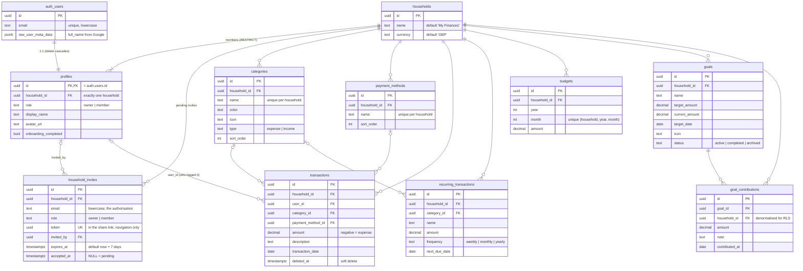
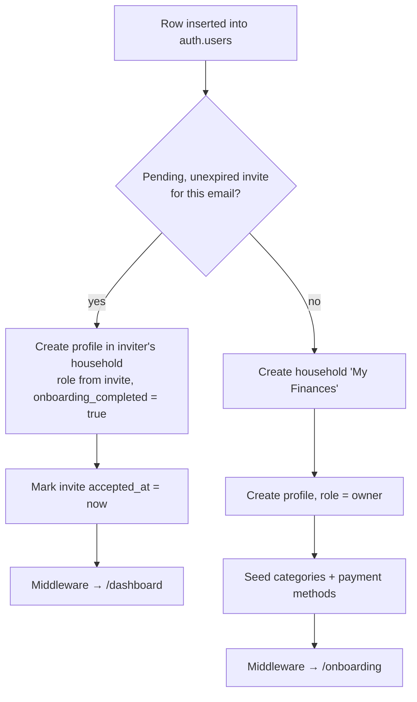

# Database

> **Last updated:** 2026-09-26 (through migration `20260926000002_create_household_invite.sql`)
> **New to databases?** Start with [DATABASE_BASICS.md](./DATABASE_BASICS.md).
> **Source of truth:** `supabase/migrations/`. If this diagram and a migration disagree, the migration wins — update this file.

## Entity-relationship diagram

`created_at` / `updated_at` exist on every table and are omitted for readability.

## How to read it

- **Everything hangs off `households`.** It is the tenant. Every data table
  carries `household_id`, and deleting a household cascades to all of them.
- **A user belongs to exactly one household** (`profiles.household_id`, single
  FK). Joining a household *moves* the user. See
  [HOUSEHOLD_SHARING_DESIGN.md](./HOUSEHOLD_SHARING_DESIGN.md) Decision 1.
- **`profiles` → `households` is `ON DELETE RESTRICT`**: a household can't be
  deleted while it has members. The reverse isn't enforced, so households can
  be left with no members (KAN-24).

## Signup: `handle_new_user()`

A trigger on `auth.users` INSERT. It runs inside the auth transaction, so an
error here fails **every** signup.

Tests: `supabase/tests/consume_invite_at_signup.sql` (runs in a rolled-back
transaction).

## Security model

| Layer | What it does |
|---|---|
| `GRANT … TO authenticated` | Table visible to supabase-js at all (required for new tables — see CLAUDE.md) |
| RLS policies | Row access: `household_id = get_user_household_id()` |
| `is_household_owner()` | Gates admin actions (invites) |
| `create_household_invite()` | The only way the UI creates invites. Owner-only; applies the ACTIVE/PENDING/EXPIRED claim rules (tests: `supabase/tests/create_household_invite.sql`) |
| Column-level `GRANT UPDATE` on `profiles` | Clients may only update `display_name`, `avatar_url`, `onboarding_completed`. `household_id` and `role` are writable only by `SECURITY DEFINER` functions |

Policies call `get_user_household_id()` rather than inlining the lookup, so a
future move to multi-household means rewriting one function, not every policy.
